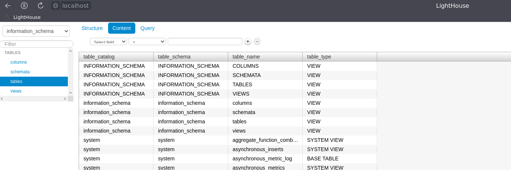

## 08.03 Использование Yandex Cloud

Сделано:
 - docker-compose добавлен контейнер для lighthouse, использован network_mode: "host" для всех контейнеров
 - добавлен хост light-01 в inventory prod.yml (connector docker)
 - добавлены переменные для light-01
 
 playbook site.yml
 - добавлен блок с тасками для установки lighthouse на хост light-01
   1) добавление репозитория nginx 
   2) установка nginx, unzip (требуется для распаковки lighthouse, т.к. скачивается в zip)
   3) Скачиваем zip с lighthouse
   2) распаковываем архив
   3) копируется template конфига nginx в default.conf
   4) проверяем запущен ли nginx (systemd docker, поэтому запускаю через шелл nginx)
   5) если не запущен - запускаем
 - дабавлен тэг light
 - добавлено условие на блок по ansible_hostname
 
 
<details>
    <summary> Вывод запуска site.yml --diff </summary>

```diff
$ ansible-playbook -i ./inventory/prod.yml site.yml --diff

PLAY [Install Clickhouse & Vector & Lighthouse] **********************************************************************************************************************************************************************************************************************************

TASK [Gathering Facts] ***********************************************************************************************************************************************************************************************************************************************************
ok: [light-01]
ok: [clickhouse-01]
ok: [vector-01]

TASK [Get clickhouse distrib] ****************************************************************************************************************************************************************************************************************************************************
skipping: [vector-01]
skipping: [light-01]
changed: [clickhouse-01] => (item=clickhouse-client)
changed: [clickhouse-01] => (item=clickhouse-server)
failed: [clickhouse-01] (item=clickhouse-common-static) => {"ansible_loop_var": "item", "changed": false, "dest": "./clickhouse-common-static-22.3.3.44.rpm", "elapsed": 0, "item": "clickhouse-common-static", "msg": "Request failed", "response": "HTTP Error 404: Not Found", "status_code": 404, "url": "https://packages.clickhouse.com/rpm/stable/clickhouse-common-static-22.3.3.44.noarch.rpm"}

TASK [Get clickhouse distrib] ****************************************************************************************************************************************************************************************************************************************************
changed: [clickhouse-01]

TASK [Install clickhouse packages] ***********************************************************************************************************************************************************************************************************************************************
skipping: [vector-01]
skipping: [light-01]
changed: [clickhouse-01]

TASK [restart clickhouse-server] *************************************************************************************************************************************************************************************************************************************************
skipping: [vector-01]
skipping: [light-01]
changed: [clickhouse-01]

TASK [Create database] ***********************************************************************************************************************************************************************************************************************************************************
skipping: [vector-01]
skipping: [light-01]
changed: [clickhouse-01]

TASK [Download vector rpm] *******************************************************************************************************************************************************************************************************************************************************
skipping: [clickhouse-01]
skipping: [light-01]
changed: [vector-01]

TASK [Install vector rpm] ********************************************************************************************************************************************************************************************************************************************************
skipping: [clickhouse-01]
skipping: [light-01]
changed: [vector-01]

TASK [Vector version] ************************************************************************************************************************************************************************************************************************************************************
skipping: [clickhouse-01]
skipping: [light-01]
changed: [vector-01]

TASK [ansible.builtin.debug] *****************************************************************************************************************************************************************************************************************************************************
skipping: [clickhouse-01]
ok: [vector-01] => {
    "vector_info.stdout": "vector 0.22.2 (x86_64-unknown-linux-gnu 0024c92 2022-06-15)"
}
skipping: [light-01]

TASK [Create repo for nginx] *****************************************************************************************************************************************************************************************************************************************************
skipping: [clickhouse-01]
skipping: [vector-01]
--- before
+++ after: /home/vvk/dz/7.1/ans_try/8.3/nginx.repo
@@ -0,0 +1,8 @@
+[nginx-stable]
+name=nginx stable repo
+baseurl=http://nginx.org/packages/centos/$releasever/$basearch/
+gpgcheck=1
+enabled=1
+gpgkey=https://nginx.org/keys/nginx_signing.key
+module_hotfixes=true
+

changed: [light-01]

TASK [Install nginx & unzip] *****************************************************************************************************************************************************************************************************************************************************
skipping: [clickhouse-01]
skipping: [vector-01]
changed: [light-01]

TASK [Download lighthouse archive] ***********************************************************************************************************************************************************************************************************************************************
skipping: [clickhouse-01]
skipping: [vector-01]
changed: [light-01]

TASK [Unpack archive] ************************************************************************************************************************************************************************************************************************************************************
skipping: [clickhouse-01]
skipping: [vector-01]
>d++++++.?? lighthouse-master/
>f++++++.?? lighthouse-master/LICENSE
>f++++++.?? lighthouse-master/README.md
>f++++++.?? lighthouse-master/app.js
>d++++++.?? lighthouse-master/css/
>f++++++.?? lighthouse-master/css/bootstrap-responsive.css
>f++++++.?? lighthouse-master/css/bootstrap-responsive.min.css
>f++++++.?? lighthouse-master/css/bootstrap.css
>f++++++.?? lighthouse-master/css/bootstrap.min.css
>d++++++.?? lighthouse-master/img/
>f++++++.?? lighthouse-master/img/glyphicons-halflings-white.png
>f++++++.?? lighthouse-master/img/glyphicons-halflings.png
>f++++++.?? lighthouse-master/img/loading.svg
>f++++++.?? lighthouse-master/index.html
>f++++++.?? lighthouse-master/jquery.js
>d++++++.?? lighthouse-master/js/
>d++++++.?? lighthouse-master/js/ace-min/
>f++++++.?? lighthouse-master/js/ace-min/ace.js
>f++++++.?? lighthouse-master/js/ace-min/ch_completions_help.js
>f++++++.?? lighthouse-master/js/ace-min/clickhouse_highlight_rules.js
>f++++++.?? lighthouse-master/js/ace-min/ext-beautify.js
>f++++++.?? lighthouse-master/js/ace-min/ext-elastic_tabstops_lite.js
>f++++++.?? lighthouse-master/js/ace-min/ext-emmet.js
>f++++++.?? lighthouse-master/js/ace-min/ext-error_marker.js
>f++++++.?? lighthouse-master/js/ace-min/ext-keybinding_menu.js
>f++++++.?? lighthouse-master/js/ace-min/ext-language_tools.js
>f++++++.?? lighthouse-master/js/ace-min/ext-linking.js
>f++++++.?? lighthouse-master/js/ace-min/ext-modelist.js
>f++++++.?? lighthouse-master/js/ace-min/ext-options.js
>f++++++.?? lighthouse-master/js/ace-min/ext-searchbox.js
>f++++++.?? lighthouse-master/js/ace-min/ext-settings_menu.js
>f++++++.?? lighthouse-master/js/ace-min/ext-spellcheck.js
>f++++++.?? lighthouse-master/js/ace-min/ext-split.js
>f++++++.?? lighthouse-master/js/ace-min/ext-static_highlight.js
>f++++++.?? lighthouse-master/js/ace-min/ext-statusbar.js
>f++++++.?? lighthouse-master/js/ace-min/ext-textarea.js
>f++++++.?? lighthouse-master/js/ace-min/ext-themelist.js
>f++++++.?? lighthouse-master/js/ace-min/ext-whitespace.js
>f++++++.?? lighthouse-master/js/ace-min/keybinding-emacs.js
>f++++++.?? lighthouse-master/js/ace-min/keybinding-vim.js
>f++++++.?? lighthouse-master/js/ace-min/mode-abap.js
>f++++++.?? lighthouse-master/js/ace-min/mode-abc.js
>f++++++.?? lighthouse-master/js/ace-min/mode-actionscript.js
>f++++++.?? lighthouse-master/js/ace-min/mode-ada.js
>f++++++.?? lighthouse-master/js/ace-min/mode-apache_conf.js
>f++++++.?? lighthouse-master/js/ace-min/mode-applescript.js
>f++++++.?? lighthouse-master/js/ace-min/mode-asciidoc.js
>f++++++.?? lighthouse-master/js/ace-min/mode-assembly_x86.js
>f++++++.?? lighthouse-master/js/ace-min/mode-autohotkey.js
>f++++++.?? lighthouse-master/js/ace-min/mode-batchfile.js
>f++++++.?? lighthouse-master/js/ace-min/mode-bro.js
>f++++++.?? lighthouse-master/js/ace-min/mode-c9search.js
>f++++++.?? lighthouse-master/js/ace-min/mode-c_cpp.js
>f++++++.?? lighthouse-master/js/ace-min/mode-cirru.js
>f++++++.?? lighthouse-master/js/ace-min/mode-clickhouse.js
>f++++++.?? lighthouse-master/js/ace-min/mode-clojure.js
>f++++++.?? lighthouse-master/js/ace-min/mode-cobol.js
>f++++++.?? lighthouse-master/js/ace-min/mode-coffee.js
>f++++++.?? lighthouse-master/js/ace-min/mode-coldfusion.js
>f++++++.?? lighthouse-master/js/ace-min/mode-csharp.js
>f++++++.?? lighthouse-master/js/ace-min/mode-csound_document.js
>f++++++.?? lighthouse-master/js/ace-min/mode-csound_orchestra.js
>f++++++.?? lighthouse-master/js/ace-min/mode-csound_score.js
>f++++++.?? lighthouse-master/js/ace-min/mode-csp.js
>f++++++.?? lighthouse-master/js/ace-min/mode-css.js
>f++++++.?? lighthouse-master/js/ace-min/mode-curly.js
>f++++++.?? lighthouse-master/js/ace-min/mode-d.js
>f++++++.?? lighthouse-master/js/ace-min/mode-dart.js
>f++++++.?? lighthouse-master/js/ace-min/mode-diff.js
>f++++++.?? lighthouse-master/js/ace-min/mode-django.js
>f++++++.?? lighthouse-master/js/ace-min/mode-dockerfile.js
>f++++++.?? lighthouse-master/js/ace-min/mode-dot.js
>f++++++.?? lighthouse-master/js/ace-min/mode-drools.js
>f++++++.?? lighthouse-master/js/ace-min/mode-edifact.js
>f++++++.?? lighthouse-master/js/ace-min/mode-eiffel.js
>f++++++.?? lighthouse-master/js/ace-min/mode-ejs.js
>f++++++.?? lighthouse-master/js/ace-min/mode-elixir.js
>f++++++.?? lighthouse-master/js/ace-min/mode-elm.js
>f++++++.?? lighthouse-master/js/ace-min/mode-erlang.js
>f++++++.?? lighthouse-master/js/ace-min/mode-forth.js
>f++++++.?? lighthouse-master/js/ace-min/mode-fortran.js
>f++++++.?? lighthouse-master/js/ace-min/mode-ftl.js
>f++++++.?? lighthouse-master/js/ace-min/mode-gcode.js
>f++++++.?? lighthouse-master/js/ace-min/mode-gherkin.js
>f++++++.?? lighthouse-master/js/ace-min/mode-gitignore.js
>f++++++.?? lighthouse-master/js/ace-min/mode-glsl.js
>f++++++.?? lighthouse-master/js/ace-min/mode-gobstones.js
>f++++++.?? lighthouse-master/js/ace-min/mode-golang.js
>f++++++.?? lighthouse-master/js/ace-min/mode-graphqlschema.js
>f++++++.?? lighthouse-master/js/ace-min/mode-groovy.js
>f++++++.?? lighthouse-master/js/ace-min/mode-haml.js
>f++++++.?? lighthouse-master/js/ace-min/mode-handlebars.js
>f++++++.?? lighthouse-master/js/ace-min/mode-haskell.js
>f++++++.?? lighthouse-master/js/ace-min/mode-haskell_cabal.js
>f++++++.?? lighthouse-master/js/ace-min/mode-haxe.js
>f++++++.?? lighthouse-master/js/ace-min/mode-hjson.js
>f++++++.?? lighthouse-master/js/ace-min/mode-html.js
>f++++++.?? lighthouse-master/js/ace-min/mode-html_elixir.js
>f++++++.?? lighthouse-master/js/ace-min/mode-html_ruby.js
>f++++++.?? lighthouse-master/js/ace-min/mode-ini.js
>f++++++.?? lighthouse-master/js/ace-min/mode-io.js
>f++++++.?? lighthouse-master/js/ace-min/mode-jack.js
>f++++++.?? lighthouse-master/js/ace-min/mode-jade.js
>f++++++.?? lighthouse-master/js/ace-min/mode-java.js
>f++++++.?? lighthouse-master/js/ace-min/mode-javascript.js
>f++++++.?? lighthouse-master/js/ace-min/mode-json.js
>f++++++.?? lighthouse-master/js/ace-min/mode-jsoniq.js
>f++++++.?? lighthouse-master/js/ace-min/mode-jsp.js
>f++++++.?? lighthouse-master/js/ace-min/mode-jssm.js
>f++++++.?? lighthouse-master/js/ace-min/mode-jsx.js
>f++++++.?? lighthouse-master/js/ace-min/mode-julia.js
>f++++++.?? lighthouse-master/js/ace-min/mode-kotlin.js
>f++++++.?? lighthouse-master/js/ace-min/mode-latex.js
>f++++++.?? lighthouse-master/js/ace-min/mode-less.js
>f++++++.?? lighthouse-master/js/ace-min/mode-liquid.js
>f++++++.?? lighthouse-master/js/ace-min/mode-lisp.js
>f++++++.?? lighthouse-master/js/ace-min/mode-livescript.js
>f++++++.?? lighthouse-master/js/ace-min/mode-logiql.js
>f++++++.?? lighthouse-master/js/ace-min/mode-lsl.js
>f++++++.?? lighthouse-master/js/ace-min/mode-lua.js
>f++++++.?? lighthouse-master/js/ace-min/mode-luapage.js
>f++++++.?? lighthouse-master/js/ace-min/mode-lucene.js
>f++++++.?? lighthouse-master/js/ace-min/mode-makefile.js
>f++++++.?? lighthouse-master/js/ace-min/mode-markdown.js
>f++++++.?? lighthouse-master/js/ace-min/mode-mask.js
>f++++++.?? lighthouse-master/js/ace-min/mode-matlab.js
>f++++++.?? lighthouse-master/js/ace-min/mode-maze.js
>f++++++.?? lighthouse-master/js/ace-min/mode-mel.js
>f++++++.?? lighthouse-master/js/ace-min/mode-mixal.js
>f++++++.?? lighthouse-master/js/ace-min/mode-mushcode.js
>f++++++.?? lighthouse-master/js/ace-min/mode-mysql.js
>f++++++.?? lighthouse-master/js/ace-min/mode-nix.js
>f++++++.?? lighthouse-master/js/ace-min/mode-nsis.js
>f++++++.?? lighthouse-master/js/ace-min/mode-objectivec.js
>f++++++.?? lighthouse-master/js/ace-min/mode-ocaml.js
>f++++++.?? lighthouse-master/js/ace-min/mode-pascal.js
>f++++++.?? lighthouse-master/js/ace-min/mode-perl.js
>f++++++.?? lighthouse-master/js/ace-min/mode-pgsql.js
>f++++++.?? lighthouse-master/js/ace-min/mode-php.js
>f++++++.?? lighthouse-master/js/ace-min/mode-pig.js
>f++++++.?? lighthouse-master/js/ace-min/mode-plain_text.js
>f++++++.?? lighthouse-master/js/ace-min/mode-powershell.js
>f++++++.?? lighthouse-master/js/ace-min/mode-praat.js
>f++++++.?? lighthouse-master/js/ace-min/mode-prolog.js
>f++++++.?? lighthouse-master/js/ace-min/mode-properties.js
>f++++++.?? lighthouse-master/js/ace-min/mode-protobuf.js
>f++++++.?? lighthouse-master/js/ace-min/mode-python.js
>f++++++.?? lighthouse-master/js/ace-min/mode-r.js
>f++++++.?? lighthouse-master/js/ace-min/mode-razor.js
>f++++++.?? lighthouse-master/js/ace-min/mode-rdoc.js
>f++++++.?? lighthouse-master/js/ace-min/mode-red.js
>f++++++.?? lighthouse-master/js/ace-min/mode-redshift.js
>f++++++.?? lighthouse-master/js/ace-min/mode-rhtml.js
>f++++++.?? lighthouse-master/js/ace-min/mode-rst.js
>f++++++.?? lighthouse-master/js/ace-min/mode-ruby.js
>f++++++.?? lighthouse-master/js/ace-min/mode-rust.js
>f++++++.?? lighthouse-master/js/ace-min/mode-sass.js
>f++++++.?? lighthouse-master/js/ace-min/mode-scad.js
>f++++++.?? lighthouse-master/js/ace-min/mode-scala.js
>f++++++.?? lighthouse-master/js/ace-min/mode-scheme.js
>f++++++.?? lighthouse-master/js/ace-min/mode-scss.js
>f++++++.?? lighthouse-master/js/ace-min/mode-sh.js
>f++++++.?? lighthouse-master/js/ace-min/mode-sjs.js
>f++++++.?? lighthouse-master/js/ace-min/mode-smarty.js
>f++++++.?? lighthouse-master/js/ace-min/mode-snippets.js
>f++++++.?? lighthouse-master/js/ace-min/mode-soy_template.js
>f++++++.?? lighthouse-master/js/ace-min/mode-space.js
>f++++++.?? lighthouse-master/js/ace-min/mode-sparql.js
>f++++++.?? lighthouse-master/js/ace-min/mode-sql.js
>f++++++.?? lighthouse-master/js/ace-min/mode-sqlserver.js
>f++++++.?? lighthouse-master/js/ace-min/mode-stylus.js
>f++++++.?? lighthouse-master/js/ace-min/mode-svg.js
>f++++++.?? lighthouse-master/js/ace-min/mode-swift.js
>f++++++.?? lighthouse-master/js/ace-min/mode-tcl.js
>f++++++.?? lighthouse-master/js/ace-min/mode-tex.js
>f++++++.?? lighthouse-master/js/ace-min/mode-text.js
>f++++++.?? lighthouse-master/js/ace-min/mode-textile.js
>f++++++.?? lighthouse-master/js/ace-min/mode-toml.js
>f++++++.?? lighthouse-master/js/ace-min/mode-tsx.js
>f++++++.?? lighthouse-master/js/ace-min/mode-turtle.js
>f++++++.?? lighthouse-master/js/ace-min/mode-twig.js
>f++++++.?? lighthouse-master/js/ace-min/mode-typescript.js
>f++++++.?? lighthouse-master/js/ace-min/mode-vala.js
>f++++++.?? lighthouse-master/js/ace-min/mode-vbscript.js
>f++++++.?? lighthouse-master/js/ace-min/mode-velocity.js
>f++++++.?? lighthouse-master/js/ace-min/mode-verilog.js
>f++++++.?? lighthouse-master/js/ace-min/mode-vhdl.js
>f++++++.?? lighthouse-master/js/ace-min/mode-wollok.js
>f++++++.?? lighthouse-master/js/ace-min/mode-xml.js
>f++++++.?? lighthouse-master/js/ace-min/mode-xquery.js
>f++++++.?? lighthouse-master/js/ace-min/mode-yaml.js
>d++++++.?? lighthouse-master/js/ace-min/snippets/
>f++++++.?? lighthouse-master/js/ace-min/snippets/abap.js
>f++++++.?? lighthouse-master/js/ace-min/snippets/abc.js
>f++++++.?? lighthouse-master/js/ace-min/snippets/actionscript.js
>f++++++.?? lighthouse-master/js/ace-min/snippets/ada.js
>f++++++.?? lighthouse-master/js/ace-min/snippets/apache_conf.js
>f++++++.?? lighthouse-master/js/ace-min/snippets/applescript.js
>f++++++.?? lighthouse-master/js/ace-min/snippets/asciidoc.js
>f++++++.?? lighthouse-master/js/ace-min/snippets/assembly_x86.js
>f++++++.?? lighthouse-master/js/ace-min/snippets/autohotkey.js
>f++++++.?? lighthouse-master/js/ace-min/snippets/batchfile.js
>f++++++.?? lighthouse-master/js/ace-min/snippets/bro.js
>f++++++.?? lighthouse-master/js/ace-min/snippets/c9search.js
>f++++++.?? lighthouse-master/js/ace-min/snippets/c_cpp.js
>f++++++.?? lighthouse-master/js/ace-min/snippets/cirru.js
>f++++++.?? lighthouse-master/js/ace-min/snippets/clickhouse.js
>f++++++.?? lighthouse-master/js/ace-min/snippets/clojure.js
>f++++++.?? lighthouse-master/js/ace-min/snippets/cobol.js
>f++++++.?? lighthouse-master/js/ace-min/snippets/coffee.js
>f++++++.?? lighthouse-master/js/ace-min/snippets/coldfusion.js
>f++++++.?? lighthouse-master/js/ace-min/snippets/csharp.js
>f++++++.?? lighthouse-master/js/ace-min/snippets/csound_document.js
>f++++++.?? lighthouse-master/js/ace-min/snippets/csound_orchestra.js
>f++++++.?? lighthouse-master/js/ace-min/snippets/csound_score.js
>f++++++.?? lighthouse-master/js/ace-min/snippets/csp.js
>f++++++.?? lighthouse-master/js/ace-min/snippets/css.js
>f++++++.?? lighthouse-master/js/ace-min/snippets/curly.js
>f++++++.?? lighthouse-master/js/ace-min/snippets/d.js
>f++++++.?? lighthouse-master/js/ace-min/snippets/dart.js
>f++++++.?? lighthouse-master/js/ace-min/snippets/diff.js
>f++++++.?? lighthouse-master/js/ace-min/snippets/django.js
>f++++++.?? lighthouse-master/js/ace-min/snippets/dockerfile.js
>f++++++.?? lighthouse-master/js/ace-min/snippets/dot.js
>f++++++.?? lighthouse-master/js/ace-min/snippets/drools.js
>f++++++.?? lighthouse-master/js/ace-min/snippets/edifact.js
>f++++++.?? lighthouse-master/js/ace-min/snippets/eiffel.js
>f++++++.?? lighthouse-master/js/ace-min/snippets/ejs.js
>f++++++.?? lighthouse-master/js/ace-min/snippets/elixir.js
>f++++++.?? lighthouse-master/js/ace-min/snippets/elm.js
>f++++++.?? lighthouse-master/js/ace-min/snippets/erlang.js
>f++++++.?? lighthouse-master/js/ace-min/snippets/forth.js
>f++++++.?? lighthouse-master/js/ace-min/snippets/fortran.js
>f++++++.?? lighthouse-master/js/ace-min/snippets/ftl.js
>f++++++.?? lighthouse-master/js/ace-min/snippets/gcode.js
>f++++++.?? lighthouse-master/js/ace-min/snippets/gherkin.js
>f++++++.?? lighthouse-master/js/ace-min/snippets/gitignore.js
>f++++++.?? lighthouse-master/js/ace-min/snippets/glsl.js
>f++++++.?? lighthouse-master/js/ace-min/snippets/gobstones.js
>f++++++.?? lighthouse-master/js/ace-min/snippets/golang.js
>f++++++.?? lighthouse-master/js/ace-min/snippets/graphqlschema.js
>f++++++.?? lighthouse-master/js/ace-min/snippets/groovy.js
>f++++++.?? lighthouse-master/js/ace-min/snippets/haml.js
>f++++++.?? lighthouse-master/js/ace-min/snippets/handlebars.js
>f++++++.?? lighthouse-master/js/ace-min/snippets/haskell.js
>f++++++.?? lighthouse-master/js/ace-min/snippets/haskell_cabal.js
>f++++++.?? lighthouse-master/js/ace-min/snippets/haxe.js
>f++++++.?? lighthouse-master/js/ace-min/snippets/hjson.js
>f++++++.?? lighthouse-master/js/ace-min/snippets/html.js
>f++++++.?? lighthouse-master/js/ace-min/snippets/html_elixir.js
>f++++++.?? lighthouse-master/js/ace-min/snippets/html_ruby.js
>f++++++.?? lighthouse-master/js/ace-min/snippets/ini.js
>f++++++.?? lighthouse-master/js/ace-min/snippets/io.js
>f++++++.?? lighthouse-master/js/ace-min/snippets/jack.js
>f++++++.?? lighthouse-master/js/ace-min/snippets/jade.js
>f++++++.?? lighthouse-master/js/ace-min/snippets/java.js
>f++++++.?? lighthouse-master/js/ace-min/snippets/javascript.js
>f++++++.?? lighthouse-master/js/ace-min/snippets/json.js
>f++++++.?? lighthouse-master/js/ace-min/snippets/jsoniq.js
>f++++++.?? lighthouse-master/js/ace-min/snippets/jsp.js
>f++++++.?? lighthouse-master/js/ace-min/snippets/jssm.js
>f++++++.?? lighthouse-master/js/ace-min/snippets/jsx.js
>f++++++.?? lighthouse-master/js/ace-min/snippets/julia.js
>f++++++.?? lighthouse-master/js/ace-min/snippets/kotlin.js
>f++++++.?? lighthouse-master/js/ace-min/snippets/latex.js
>f++++++.?? lighthouse-master/js/ace-min/snippets/less.js
>f++++++.?? lighthouse-master/js/ace-min/snippets/liquid.js
>f++++++.?? lighthouse-master/js/ace-min/snippets/lisp.js
>f++++++.?? lighthouse-master/js/ace-min/snippets/livescript.js
>f++++++.?? lighthouse-master/js/ace-min/snippets/logiql.js
>f++++++.?? lighthouse-master/js/ace-min/snippets/lsl.js
>f++++++.?? lighthouse-master/js/ace-min/snippets/lua.js
>f++++++.?? lighthouse-master/js/ace-min/snippets/luapage.js
>f++++++.?? lighthouse-master/js/ace-min/snippets/lucene.js
>f++++++.?? lighthouse-master/js/ace-min/snippets/makefile.js
>f++++++.?? lighthouse-master/js/ace-min/snippets/markdown.js
>f++++++.?? lighthouse-master/js/ace-min/snippets/mask.js
>f++++++.?? lighthouse-master/js/ace-min/snippets/matlab.js
>f++++++.?? lighthouse-master/js/ace-min/snippets/maze.js
>f++++++.?? lighthouse-master/js/ace-min/snippets/mel.js
>f++++++.?? lighthouse-master/js/ace-min/snippets/mixal.js
>f++++++.?? lighthouse-master/js/ace-min/snippets/mushcode.js
>f++++++.?? lighthouse-master/js/ace-min/snippets/mysql.js
>f++++++.?? lighthouse-master/js/ace-min/snippets/nix.js
>f++++++.?? lighthouse-master/js/ace-min/snippets/nsis.js
>f++++++.?? lighthouse-master/js/ace-min/snippets/objectivec.js
>f++++++.?? lighthouse-master/js/ace-min/snippets/ocaml.js
>f++++++.?? lighthouse-master/js/ace-min/snippets/pascal.js
>f++++++.?? lighthouse-master/js/ace-min/snippets/perl.js
>f++++++.?? lighthouse-master/js/ace-min/snippets/pgsql.js
>f++++++.?? lighthouse-master/js/ace-min/snippets/php.js
>f++++++.?? lighthouse-master/js/ace-min/snippets/pig.js
>f++++++.?? lighthouse-master/js/ace-min/snippets/plain_text.js
>f++++++.?? lighthouse-master/js/ace-min/snippets/powershell.js
>f++++++.?? lighthouse-master/js/ace-min/snippets/praat.js
>f++++++.?? lighthouse-master/js/ace-min/snippets/prolog.js
>f++++++.?? lighthouse-master/js/ace-min/snippets/properties.js
>f++++++.?? lighthouse-master/js/ace-min/snippets/protobuf.js
>f++++++.?? lighthouse-master/js/ace-min/snippets/python.js
>f++++++.?? lighthouse-master/js/ace-min/snippets/r.js
>f++++++.?? lighthouse-master/js/ace-min/snippets/razor.js
>f++++++.?? lighthouse-master/js/ace-min/snippets/rdoc.js
>f++++++.?? lighthouse-master/js/ace-min/snippets/red.js
>f++++++.?? lighthouse-master/js/ace-min/snippets/redshift.js
>f++++++.?? lighthouse-master/js/ace-min/snippets/rhtml.js
>f++++++.?? lighthouse-master/js/ace-min/snippets/rst.js
>f++++++.?? lighthouse-master/js/ace-min/snippets/ruby.js
>f++++++.?? lighthouse-master/js/ace-min/snippets/rust.js
>f++++++.?? lighthouse-master/js/ace-min/snippets/sass.js
>f++++++.?? lighthouse-master/js/ace-min/snippets/scad.js
>f++++++.?? lighthouse-master/js/ace-min/snippets/scala.js
>f++++++.?? lighthouse-master/js/ace-min/snippets/scheme.js
>f++++++.?? lighthouse-master/js/ace-min/snippets/scss.js
>f++++++.?? lighthouse-master/js/ace-min/snippets/sh.js
>f++++++.?? lighthouse-master/js/ace-min/snippets/sjs.js
>f++++++.?? lighthouse-master/js/ace-min/snippets/smarty.js
>f++++++.?? lighthouse-master/js/ace-min/snippets/snippets.js
>f++++++.?? lighthouse-master/js/ace-min/snippets/soy_template.js
>f++++++.?? lighthouse-master/js/ace-min/snippets/space.js
>f++++++.?? lighthouse-master/js/ace-min/snippets/sparql.js
>f++++++.?? lighthouse-master/js/ace-min/snippets/sql.js
>f++++++.?? lighthouse-master/js/ace-min/snippets/sqlserver.js
>f++++++.?? lighthouse-master/js/ace-min/snippets/stylus.js
>f++++++.?? lighthouse-master/js/ace-min/snippets/svg.js
>f++++++.?? lighthouse-master/js/ace-min/snippets/swift.js
>f++++++.?? lighthouse-master/js/ace-min/snippets/tcl.js
>f++++++.?? lighthouse-master/js/ace-min/snippets/tex.js
>f++++++.?? lighthouse-master/js/ace-min/snippets/text.js
>f++++++.?? lighthouse-master/js/ace-min/snippets/textile.js
>f++++++.?? lighthouse-master/js/ace-min/snippets/toml.js
>f++++++.?? lighthouse-master/js/ace-min/snippets/tsx.js
>f++++++.?? lighthouse-master/js/ace-min/snippets/turtle.js
>f++++++.?? lighthouse-master/js/ace-min/snippets/twig.js
>f++++++.?? lighthouse-master/js/ace-min/snippets/typescript.js
>f++++++.?? lighthouse-master/js/ace-min/snippets/vala.js
>f++++++.?? lighthouse-master/js/ace-min/snippets/vbscript.js
>f++++++.?? lighthouse-master/js/ace-min/snippets/velocity.js
>f++++++.?? lighthouse-master/js/ace-min/snippets/verilog.js
>f++++++.?? lighthouse-master/js/ace-min/snippets/vhdl.js
>f++++++.?? lighthouse-master/js/ace-min/snippets/wollok.js
>f++++++.?? lighthouse-master/js/ace-min/snippets/xml.js
>f++++++.?? lighthouse-master/js/ace-min/snippets/xquery.js
>f++++++.?? lighthouse-master/js/ace-min/snippets/yaml.js
>f++++++.?? lighthouse-master/js/ace-min/theme-ambiance.js
>f++++++.?? lighthouse-master/js/ace-min/theme-chaos.js
>f++++++.?? lighthouse-master/js/ace-min/theme-chrome.js
>f++++++.?? lighthouse-master/js/ace-min/theme-clouds.js
>f++++++.?? lighthouse-master/js/ace-min/theme-clouds_midnight.js
>f++++++.?? lighthouse-master/js/ace-min/theme-cobalt.js
>f++++++.?? lighthouse-master/js/ace-min/theme-crimson_editor.js
>f++++++.?? lighthouse-master/js/ace-min/theme-dawn.js
>f++++++.?? lighthouse-master/js/ace-min/theme-dracula.js
>f++++++.?? lighthouse-master/js/ace-min/theme-dreamweaver.js
>f++++++.?? lighthouse-master/js/ace-min/theme-eclipse.js
>f++++++.?? lighthouse-master/js/ace-min/theme-github.js
>f++++++.?? lighthouse-master/js/ace-min/theme-gob.js
>f++++++.?? lighthouse-master/js/ace-min/theme-gruvbox.js
>f++++++.?? lighthouse-master/js/ace-min/theme-idle_fingers.js
>f++++++.?? lighthouse-master/js/ace-min/theme-iplastic.js
>f++++++.?? lighthouse-master/js/ace-min/theme-katzenmilch.js
>f++++++.?? lighthouse-master/js/ace-min/theme-kr_theme.js
>f++++++.?? lighthouse-master/js/ace-min/theme-kuroir.js
>f++++++.?? lighthouse-master/js/ace-min/theme-merbivore.js
>f++++++.?? lighthouse-master/js/ace-min/theme-merbivore_soft.js
>f++++++.?? lighthouse-master/js/ace-min/theme-mono_industrial.js
>f++++++.?? lighthouse-master/js/ace-min/theme-monokai.js
>f++++++.?? lighthouse-master/js/ace-min/theme-pastel_on_dark.js
>f++++++.?? lighthouse-master/js/ace-min/theme-solarized_dark.js
>f++++++.?? lighthouse-master/js/ace-min/theme-solarized_light.js
>f++++++.?? lighthouse-master/js/ace-min/theme-sqlserver.js
>f++++++.?? lighthouse-master/js/ace-min/theme-terminal.js
>f++++++.?? lighthouse-master/js/ace-min/theme-textmate.js
>f++++++.?? lighthouse-master/js/ace-min/theme-tomorrow.js
>f++++++.?? lighthouse-master/js/ace-min/theme-tomorrow_night.js
>f++++++.?? lighthouse-master/js/ace-min/theme-tomorrow_night_blue.js
>f++++++.?? lighthouse-master/js/ace-min/theme-tomorrow_night_bright.js
>f++++++.?? lighthouse-master/js/ace-min/theme-tomorrow_night_eighties.js
>f++++++.?? lighthouse-master/js/ace-min/theme-twilight.js
>f++++++.?? lighthouse-master/js/ace-min/theme-vibrant_ink.js
>f++++++.?? lighthouse-master/js/ace-min/theme-xcode.js
>f++++++.?? lighthouse-master/js/ace-min/worker-coffee.js
>f++++++.?? lighthouse-master/js/ace-min/worker-css.js
>f++++++.?? lighthouse-master/js/ace-min/worker-html.js
>f++++++.?? lighthouse-master/js/ace-min/worker-javascript.js
>f++++++.?? lighthouse-master/js/ace-min/worker-json.js
>f++++++.?? lighthouse-master/js/ace-min/worker-lua.js
>f++++++.?? lighthouse-master/js/ace-min/worker-php.js
>f++++++.?? lighthouse-master/js/ace-min/worker-xml.js
>f++++++.?? lighthouse-master/js/ace-min/worker-xquery.js
>f++++++.?? lighthouse-master/js/ag-grid.min.js
>f++++++.?? lighthouse-master/js/bootstrap.js
>f++++++.?? lighthouse-master/js/bootstrap.min.js
changed: [light-01]

TASK [Create nginx config (default)] *********************************************************************************************************************************************************************************************************************************************
skipping: [clickhouse-01]
skipping: [vector-01]
--- before: /etc/nginx/conf.d/default.conf
+++ after: /home/vvk/.ansible/tmp/ansible-local-247591ae2ubdgg/tmpoq8_0eje/nginx_light.conf.j2
@@ -1,44 +1,12 @@
 server {
     listen       80;
-    server_name  localhost;
+    server_name  light-01;
 
-    #access_log  /var/log/nginx/host.access.log  main;
+    access_log  /var/log/nginx/access.log  main;
 
     location / {
-        root   /usr/share/nginx/html;
+        root   /opt/lighthouse-master;
         index  index.html index.htm;
     }
 
-    #error_page  404              /404.html;
-
-    # redirect server error pages to the static page /50x.html
-    #
-    error_page   500 502 503 504  /50x.html;
-    location = /50x.html {
-        root   /usr/share/nginx/html;
-    }
-
-    # proxy the PHP scripts to Apache listening on 127.0.0.1:80
-    #
-    #location ~ \.php$ {
-    #    proxy_pass   http://127.0.0.1;
-    #}
-
-    # pass the PHP scripts to FastCGI server listening on 127.0.0.1:9000
-    #
-    #location ~ \.php$ {
-    #    root           html;
-    #    fastcgi_pass   127.0.0.1:9000;
-    #    fastcgi_index  index.php;
-    #    fastcgi_param  SCRIPT_FILENAME  /scripts$fastcgi_script_name;
-    #    include        fastcgi_params;
-    #}
-
-    # deny access to .htaccess files, if Apache's document root
-    # concurs with nginx's one
-    #
-    #location ~ /\.ht {
-    #    deny  all;
-    #}
 }
-

changed: [light-01]

TASK [Check nginx is running] ****************************************************************************************************************************************************************************************************************************************************
skipping: [clickhouse-01]
skipping: [vector-01]
changed: [light-01]

TASK [Start nginx] ***************************************************************************************************************************************************************************************************************************************************************
skipping: [clickhouse-01]
skipping: [vector-01]
skipping: [light-01]

PLAY RECAP ***********************************************************************************************************************************************************************************************************************************************************************
clickhouse-01              : ok=5    changed=4    unreachable=0    failed=0    skipped=11   rescued=1    ignored=0   
light-01                   : ok=7    changed=6    unreachable=0    failed=0    skipped=9    rescued=0    ignored=0   
vector-01                  : ok=5    changed=3    unreachable=0    failed=0    skipped=11   rescued=0    ignored=0 
```

</details>

 - Повторный запуск не дает изменений


Lighthouse

