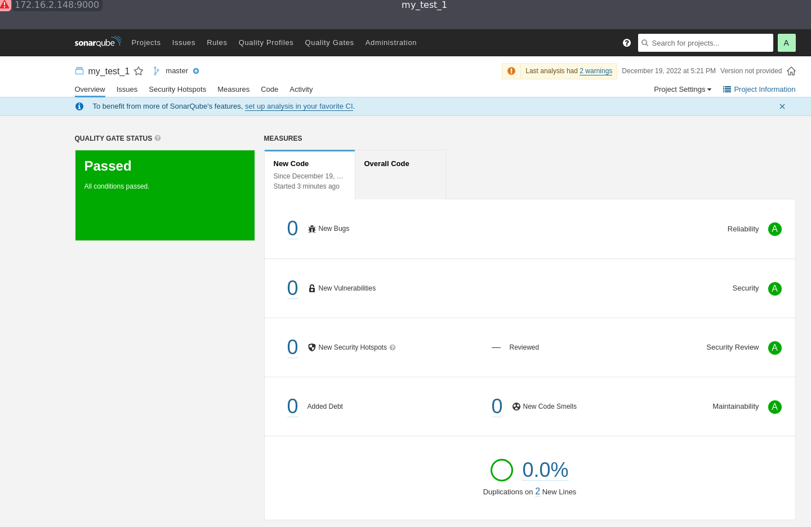

### 09.03 Процессы CI/CD
* <u> IP  адреса заменены на XXX.XXX.XXX.XXX !!! </u>

#### Знакомоство с SonarQube


1. Установлен sonar-scaner:
```shell
$ sonar-scaner --version
INFO: Scanner configuration file: /home/vvk/sonar-scanner/conf/sonar-scanner.properties
INFO: Project root configuration file: NONE
INFO: SonarScanner 4.7.0.2747
INFO: Java 11.0.14.1 Eclipse Adoptium (64-bit)
INFO: Linux 5.15.0-56-generic amd64
```
2. Запускаем проверку и исправляем найденные недочеты/ошибки:
```shell
sonar-scaner -Dsonar.projectKey=my_test_1 \
-Dsonar.sources=. \
-Dsonar.host.url=http://XXX.XXX.XXX.XXX:9000 \
-Dsonar.login=4f8b4b0a6584271522bd40b4eae8c647c5279248 \
-Dsonar.coverage.exclusions=fail.py
```


#### Знакомство с Nexus

1. <a href="https://github.com/Bambrino/ans_try/tree/main/9.3/maven-metadata.xml">maven-metadata.xml:</a>
```xml
<?xml version="1.0" encoding="UTF-8"?>
<metadata modelVersion="1.1.0">
  <groupId>netology</groupId>
  <artifactId>java</artifactId>
  <versioning>
    <latest>8_282</latest>
    <release>8_282</release>
    <versions>
      <version>8_102</version>
      <version>8_282</version>
    </versions>
    <lastUpdated>20221219144242</lastUpdated>
  </versioning>
</metadata>
```

#### Знакомство с Maven

1. <a href="https://github.com/Bambrino/ans_try/tree/main/9.3/pom.xml">pom.xml:</a>

```xml
<project xmlns="http://maven.apache.org/POM/4.0.0" xmlns:xsi="http://www.w3.org/2001/XMLSchema-instance"
  xsi:schemaLocation="http://maven.apache.org/POM/4.0.0 http://maven.apache.org/xsd/maven-4.0.0.xsd">
  <modelVersion>4.0.0</modelVersion>
 
  <groupId>com.netology.app</groupId>
  <artifactId>simple-app</artifactId>
  <version>1.0-SNAPSHOT</version>
   <repositories>
    <repository>
      <id>my-repo</id>
      <name>maven-public</name>
      <url>http://XXX.XXX.XXX.XXX:8081/repository/maven-public/</url>
    </repository>
  </repositories>
  <dependencies>
    <dependency>
      <groupId>netology</groupId>
      <artifactId>java</artifactId>
      <version>8_282</version>
      <classifier>distrib</classifier>
      <type>tar.gz</type>
    </dependency>
  </dependencies>
</project>
```
